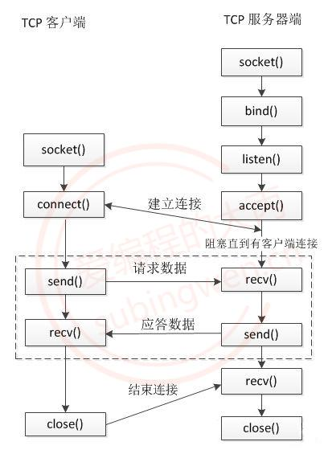

[toc]
# 网络编程

## 一、客户端-服务器模型

### 1、模型图



### 2、代码部分

#### 服务器端

```c
// server.c
#include <stdio.h>
#include <stdlib.h>
#include <unistd.h>
#include <string.h>
#include <arpa/inet.h>

int main()
{
    // 1. 创建监听的套接字
    int lfd = socket(AF_INET, SOCK_STREAM, 0);
    if(lfd == -1)
    {
        perror("socket");
        exit(0);
    }

    // 2. 将socket()返回值和本地的IP端口绑定到一起
    struct sockaddr_in addr;
    
    addr.sin_family = AF_INET;
    addr.sin_port = htons(10000);   // 大端端口
    
    // INADDR_ANY代表本机的所有IP, 假设有三个网卡就有三个IP地址
    // 这个宏可以代表任意一个IP地址
    // 这个宏一般用于本地的绑定操作
    addr.sin_addr.s_addr = INADDR_ANY;  // 这个宏的值为0 == 0.0.0.0
//    inet_pton(AF_INET, "192.168.237.131", &addr.sin_addr.s_addr);
    
    int ret = bind(lfd, (struct sockaddr*)&addr, sizeof(addr));
    if(ret == -1)
    {
        perror("bind");
        exit(0);
    }

    // 3. 设置监听
    ret = listen(lfd, 128);
    if(ret == -1)
    {
        perror("listen");
        exit(0);
    }

    // 4. 阻塞等待并接受客户端连接
    struct sockaddr_in cliaddr;
    int clilen = sizeof(cliaddr);
    int cfd = accept(lfd, (struct sockaddr*)&cliaddr, &clilen);
    if(cfd == -1)
    {
        perror("accept");
        exit(0);
    }
    // 打印客户端的地址信息
    char ip[24] = {0};
    printf("客户端的IP地址: %s, 端口: %d\n",
           inet_ntop(AF_INET, &cliaddr.sin_addr.s_addr, ip, sizeof(ip)),
           ntohs(cliaddr.sin_port));

    // 5. 和客户端通信
    while(1)
    {
        // 接收数据
        char buf[1024];
        memset(buf, 0, sizeof(buf));
        int len = read(cfd, buf, sizeof(buf));
        if(len > 0)
        {
            printf("客户端say: %s\n", buf);
            write(cfd, buf, len);
        }
        else if(len  == 0)
        {
            printf("客户端断开了连接...\n");
            break;
        }
        else
        {
            perror("read");
            break;
        }
    }

    close(cfd);
    close(lfd);

    return 0;
}
```

#### 客户端

```c
// client.c
#include <stdio.h>
#include <stdlib.h>
#include <unistd.h>
#include <string.h>
#include <arpa/inet.h>

int main()
{
    // 1. 创建通信的套接字
    int fd = socket(AF_INET, SOCK_STREAM, 0);
    if(fd == -1)
    {
        perror("socket");
        exit(0);
    }

    // 2. 连接服务器
    struct sockaddr_in addr;
    addr.sin_family = AF_INET;
    addr.sin_port = htons(10000);   // 大端端口
    inet_pton(AF_INET, "192.168.237.131", &addr.sin_addr.s_addr);

    int ret = connect(fd, (struct sockaddr*)&addr, sizeof(addr));
    if(ret == -1)
    {
        perror("connect");
        exit(0);
    }

    // 3. 和服务器端通信
    int number = 0;
    while(1)
    {
        // 发送数据
        char buf[1024];
        sprintf(buf, "你好, 服务器...%d\n", number++);
        write(fd, buf, strlen(buf)+1);
        
        // 接收数据
        memset(buf, 0, sizeof(buf));
        int len = read(fd, buf, sizeof(buf));
        if(len > 0)
        {
            printf("服务器say: %s\n", buf);
        }
        else if(len  == 0)
        {
            printf("服务器断开了连接...\n");
            break;
        }
        else
        {
            perror("read");
            break;
        }
        sleep(1);   // 每隔1s发送一条数据
    }

    close(fd);

    return 0;
}
```


## 拓展与细节

使用套接字通信函数需要包含头文件,如果包含`<arpa/inet.h>`后就不用在包含了`<socket.h>`

1. `int socket(int domain, int type, int protocol)`

   - 作用: 创建一个套接字

   - 参数:

     1. `domain`: 使用的地址族协议
        * `AF_INET`: 使用`IPv4`格式的`IP`地址
        * `AF_INET6`: 使用`IPv4`格式的`IP`地址
     2. `type`:
        - `SOCK_STREAM`: 使用流式的传输协议
        - `SOCK_DGRAM`: 使用报式(报文)的传输协议
     3. `protocol`:使用的协议，一般写0即可, 使用默认的协议
        - `SOCK_STREAM`: 流式传输默认使用的是`tcp`
        - `SOCK_DGRAM`: 报式传输默认使用的`udp`

   - 返回值：

     - 成功: 可用于套接字通信的文件描述符
     - 失败: -1

     > 函数的返回值是一个文件描述符，通过这个文件描述符可以操作内核中的某一块内存，网络通信是基于这个文件描述符来完成的。

2. `int bind(int sockfd, const struct sockaddr *addr, socklen_t addrlen)`

   - 作用: 将文件描述符和本地的`IP`与端口进行绑定   
   - 参数:
     1. `sockfd`: 监听的文件描述符, 通过`socket()`调用得到的返回值
     2. `addr`: 传入参数，要绑定的`IP`和端口信息需要初始化到这个结构体中**`IP`和端口要转换为网络字节序**
     3. `addrlen`: 参数`addr`指向的内存大小，`sizeof(struct sockaddr)`
   - 返回值：
     - 成功：0
     - 失败：-1

3. `int listen(int sockfd, int backlog)`

   - 作用：给监听的套接字设置监听
   - 参数:
     1. `sockfd`: 文件描述符, 可以通过调用`socket()`得到，在监听之前必须要绑定` bind()`
     2. `backlog`: 同时能处理的最大连接要求，最大值为128
   - 返回值：
     - 成功：0
     - 失败：-1

4. `int accept(int sockfd, struct sockaddr *addr, socklen_t *addrlen)`

   - 作用：
   - 参数:
     1. `sockfd`: 监听的文件描述符
     2. `addr`: 传出参数, 里边存储了建立连接的客户端的地址信息
     3. `addrlen`: 传入传出参数，用于存储`addr`指向的内存大小
   - 返回值：
     - 成功：得到一个文件描述符, 用于和建立连接的这个客户端通信，
     - 失败：-1

   > 这个函数是一个阻塞函数
   > 当没有新的客户端连接请求的时候，该函数阻塞；
   > 当检测到有新的客户端连接请求时，阻塞解除，新连接就建立了

5. `ssize_t read(int sockfd, void *buf, size_t size);`
   `ssize_t recv(int sockfd, void *buf, size_t size, int flags);`

   - 作用：接收数据
   - 参数:
     1. `sockfd`: 用于通信的文件描述符, `accept()` 函数的返回值
     2. `buf`: 指向一块有效内存, 用于存储接收是数据
     3. `size`: 参数`buf`指向的内存的容量
     4. `flags`: 特殊的属性, 一般不使用, 指定为 0
   - 返回值:
     - 成功：实际接收的字节数 **大于0**
     - 对方断开连接：0
     - 失败：-1

   > 这个函数是一个阻塞函数
   > 当客户端没有发送数据的时候，该函数阻塞；
   > 当检测到有客户端发送数据时，阻塞解除，开始接受数据

6. `ssize_t write(int fd, const void *buf, size_t len);`
   `ssize_t send(int fd, const void *buf, size_t len, int flags);`

   - 作用: 发送数据的函数

   - 参数:
     1. `fd`: 通信的文件描述符, `accept()` 函数的返回值
     2. `buf`: 传入参数, 要发送的字符串
     3. `len`: 要发送的字符串的长度
     4. `flags`: 特殊的属性, 一般不使用, 指定为 0
   - 返回值：
     - 成功：实际发送的字节数，和参数`len`是相等的
     - 失败：-1

7. `int connect(int sockfd, const struct sockaddr *addr, socklen_t addrlen)`

   - 作用: 连接服务器, 连接服务器之后, 客户端会自动随机绑定一个端口
   - 参数:
     - `sockfd`: 通信的文件描述符, 通过调用`socket()`函数就得到了
     - `addr`: 存储了要连接的服务器端的地址信息: `iP `和 端口，**`IP`和端口要转换为网络字节序**
     - `addrlen`: `addr`指针指向的内存的大小 `sizeof(struct sockaddr)`
   - 返回值：
     - 成功：0
     - 失败：-1

## 注：

### 1、字节序

1. 概述：大小端问题  字节是其中最小单位（两个16进制数）
   - 大端：网络字节序 低高高低
   - 小端：主机字节序  低低高高

> 数据的高低位与数字的高低类似：个位就是最低位

2. 转换：

   1. 大小端整形之间相互转换：

      ```c
      // 将一个短整形从主机字节序 -> 网络字节序
      uint16_t htons(uint16_t hostshort);	
      // 将一个整形从主机字节序 -> 网络字节序
      uint32_t htonl(uint32_t hostlong);	
      
      // 将一个短整形从网络字节序 -> 主机字节序
      uint16_t ntohs(uint16_t netshort)
      // 将一个整形从网络字节序 -> 主机字节序
      uint32_t ntohl(uint32_t netlong);
      ```

   2. 主机字节序`ip`地址（字符串）与网络字节序的转换（整形）

      1. `int inet_pton(int af, const char *src, void *dst); `

         - 作用：主机字节序的`IP`地址转换为网络字节序

         - 参数:

           1. `af`: 地址族(`IP`地址的家族包括`ipv4`和`ipv6`)协议

              - `AF_INET`: `ipv4`格式的`IP`地址

              - `AF_INET6`: `ipv6`格式的`IP`地址

           2. `src`: 传入参数, 对应要转换的点分十进制的`IP`地址: 192.168.1.100

           3. `dst`: 传出参数, 函数调用完成, 转换得到的大端整形`IP`被写入到这块内存中

         - 返回值：

           - 成功：1
           - 失败：0或者-1

      2. `const char *inet_ntop(int af, const void *src, char *dst, socklen_t size);`

         - 作用：将大端的整形数, 转换为小端的点分十进制的`IP`地址
         - 参数:
           1. `af`: 地址族协议
              - `AF_INET`: `ipv4`格式的`IP`地址
              - `AF_INET6`: `ipv6`格式的`IP`地址
           2. `src`: 传入参数, 这个指针指向的内存中存储了大端的整形`IP`地址
           3. `dst`: 传出参数, 存储转换得到的小端的点分十进制的`IP`地址
           4. `size`: 修饰`dst`参数的, 标记`dst`指向的内存中最多可以存储多少个字节
         - 返回值:
           - 成功: 指针指向第三个参数对应的内存地址, 通过返回值也可以直接取出转换得到的`IP`字符串
           - 失败: NULL

      3. 还有一组函数也能进程`IP`地址大小端的转换，但是只能处理`ipv4`的`IP`地址：

         ```c
         // 点分十进制IP -> 大端整形
         in_addr_t inet_addr (const char *cp);
         
         // 大端整形 -> 点分十进制IP
         char* inet_ntoa(struct in_addr in);
         ```

### 2、结构体

```c
typedef unsigned short  uint16_t;
typedef unsigned int    uint32_t;
typedef uint16_t in_port_t;
typedef uint32_t in_addr_t;
typedef unsigned short int sa_family_t;

struct in_addr
{
    in_addr_t s_addr;
};  

// sizeof(struct sockaddr) == sizeof(struct sockaddr_in)
struct sockaddr_in
{
    sa_family_t sin_family;     /* 地址族协议: AF_INET */
    in_port_t sin_port;         /* 端口, 2字节-> 大端  */
    struct in_addr sin_addr;    /* IP地址, 4字节 -> 大端  */
    /* 填充 8字节 */
    unsigned char sin_zero[sizeof (struct sockaddr) - sizeof(sin_family) -
                      sizeof (in_port_t) - sizeof (struct in_addr)];
};  
```

### 3、文件描述符

- 文件描述符对应的内存结构：

  - 一个文件文件描述符对应两块内存, 一块内存是读缓冲区, 一块内存是写缓冲区
  - 读缓冲区: **通过文件描述符将内存中的数据读出**
  - 写缓冲区: **通过文件描述符将数据写入到某块内存中**

  1. 监听的文件描述符:
     - 客户端的连接请求会发送到服务器端监听的文件描述符的读缓冲区中
     - 读缓冲区中有数据, 说明有新的客户端连接
     - 调用`accept()`函数, 这个函数会检测监听文件描述符的读缓冲区
       - 检测不到数据, 该函数阻塞
       - 如果检测到数据, 解除阻塞, 新的连接建立

  1. 通信的文件描述符:
     - 客户端和服务器端都有通信的文件描述符
     - 发送数据：调用函数 `write() / send()`，数据进入到内核中
       - 数据并没有被发送出去, 而是将数据写入到了通信的文件描述符对应的写缓冲区中
       - 内核检测到通信的文件描述符写缓冲区中有数据, 内核会将数据发送到网络中
     - 接收数据: 调用的函数` read() / recv()`, 从内核读数据
       - 数据如何进入到内核程序猿不需要处理, 数据进入到通信的文件描述符的读缓冲区中
       - 数据进入到内核, 必须使用通信的文件描述符, 将数据从读缓冲区中读出即可

---

作者: 苏丙榅
链接: https://subingwen.cn/linux/socket/
来源: 爱编程的大丙
著作权归作者所有。商业转载请联系作者获得授权，非商业转载请注明出处。
